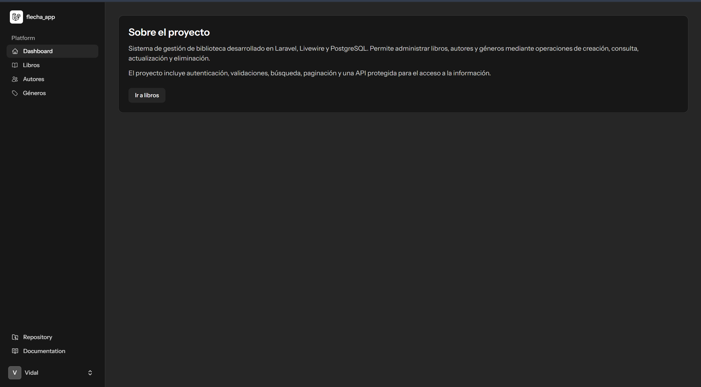
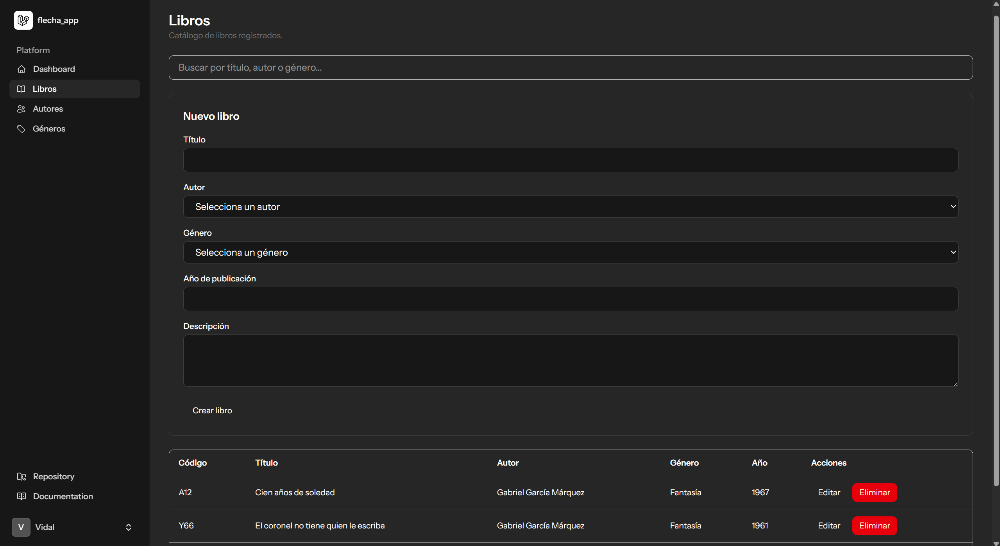
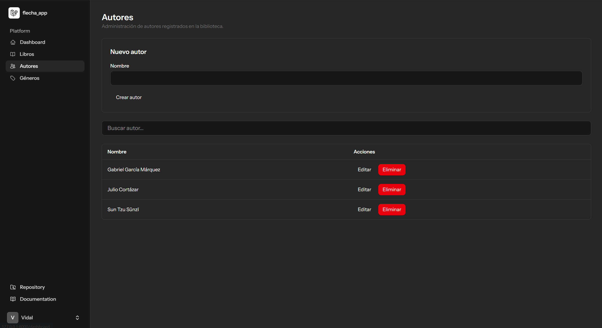
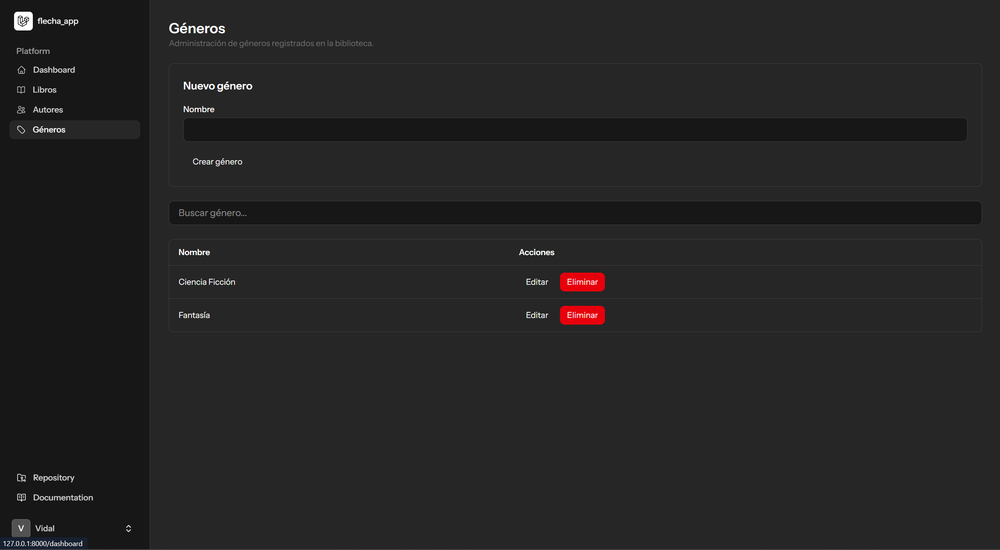

# Prototipo y Evidencia Visual

## 1. Objetivo

Este documento presenta la evidencia visual de la interfaz desarrollada para el
sistema de gestión de biblioteca.

El prototipo final fue implementado directamente sobre Laravel Livewire,
permitiendo validar tanto la propuesta visual como el comportamiento funcional
de los principales módulos.

---

## 2. Enfoque de prototipado

Debido al alcance y tiempo disponible para el ejercicio, se utilizó un enfoque
de prototipado evolutivo.

En lugar de construir un prototipo visual separado y posteriormente desecharlo,
la interfaz fue evolucionando directamente sobre componentes funcionales.

El proceso seguido fue:

```text
Requerimientos
      |
      v
Diseño inicial de pantalla
      |
      v
Componente Livewire
      |
      v
Prueba funcional
      |
      v
Ajustes visuales
      |
      v
Interfaz final
```

Este enfoque permitió validar simultáneamente:

- Navegación.
- Formularios.
- Búsquedas.
- Paginación.
- Validaciones.
- Mensajes.
- Acciones CRUD.
- Integración con datos reales.

## 3. Dashboard

El Dashboard funciona como punto de entrada al sistema.

Presenta una breve descripción del proyecto y acceso directo al módulo de libros.

Características principales:

- Navegación lateral.
- Soporte para modo claro y oscuro.
- Acceso a los principales módulos.
- Resumen del propósito de la aplicación.

### Evidencia



## 4. Administración de libros

El módulo de libros permite realizar el CRUD principal de la aplicación.

La pantalla incluye:

- Formulario de creación.
- Formulario reutilizable para edición.
- Selección de autor.
- Selección de género.
- Año de publicación.
- Descripción.
- Buscador.
- Tabla de resultados.
- Paginación.
- Acciones de edición y eliminación.
- Confirmación antes de eliminar.
- Mensajes de éxito y validación.

### Evidencia



## 5. Creación y edición de libros

El mismo formulario es utilizado tanto para crear como para actualizar registros.

En modo creación se muestra:

`Nuevo libro`

y en modo edición:

`Editar libro`

El código único del libro no es editable por el usuario.

El sistema lo genera automáticamente cuando se registra el libro.

### Evidencia


## 6. Administración de autores

El módulo de autores permite:

- Crear autores.
- Buscar autores.
- Editar autores.
- Eliminar autores sin relaciones activas.
- Mostrar mensajes de error cuando existen libros asociados.

Los nombres se normalizan automáticamente antes de almacenarse.

### Evidencia



## 7. Administración de géneros

El módulo de géneros mantiene una interfaz consistente con el módulo de autores.

Permite:

- Crear.
- Buscar.
- Editar.
- Eliminar.

La eliminación se rechaza cuando existen libros relacionados.

### Evidencia



## 8. Navegación

La aplicación utiliza navegación lateral para acceder a:

- Dashboard
- Libros
- Autores
- Géneros

El elemento correspondiente a la ruta actual se muestra como activo.

Livewire utiliza navegación dinámica mediante:

`wire:navigate`

reduciendo las recargas completas de página durante la navegación.

## 9. Diseño responsivo y temas

La interfaz utiliza Tailwind CSS y los componentes proporcionados por el starter
kit.

Se consideraron:

- Modo claro.
- Modo oscuro.
- Contraste de textos.
- Tablas con desplazamiento horizontal cuando sea necesario.
- Separación visual entre formularios y resultados.
- Retroalimentación visual para acciones.

## 10. Validaciones visuales

Los errores de formulario se presentan directamente debajo del campo
correspondiente.

Ejemplo:

```text
Título
[                     ]
El campo título es obligatorio.
```

Esto permite identificar rápidamente qué información debe corregirse.

## 11. Confirmación de eliminación

Las acciones destructivas solicitan confirmación antes de ejecutarse.

Ejemplo:

¿Estás seguro de eliminar este libro?

La confirmación reduce el riesgo de eliminación accidental.

## 12. Mensajes de resultado

Después de operaciones satisfactorias se muestran mensajes como:

- Libro creado correctamente.
- Libro actualizado correctamente.
- Libro eliminado correctamente.
- Autor creado correctamente.
- Género actualizado correctamente.

También se muestran mensajes de error para reglas como:

- No se puede eliminar el autor porque tiene libros asociados.

## 13. Consistencia visual

Los módulos de libros, autores y géneros siguen patrones visuales similares.

Esto permite que el usuario reconozca rápidamente:

```text
Formulario
      |
      v
Buscador
      |
      v
Tabla
      |
      v
Acciones
```

La consistencia reduce la curva de aprendizaje entre módulos.

## 14. Resultado del prototipo

El prototipo evolucionó hasta convertirse en una implementación funcional.

Actualmente permite validar directamente:

- Flujo de navegación.
- Registro de datos.
- Edición.
- Eliminación.
- Búsqueda.
- Validaciones.
- Restricciones de negocio.
- Persistencia en PostgreSQL.

Por esta razón, las capturas incluidas representan el prototipo final funcional
y no únicamente una maqueta estática.
